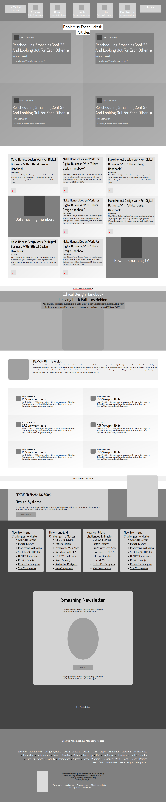

# smashing-magazine
>This is a gray scale layout of smashingmagazine.com to analyse hierarchical structure of a webpage

- CSS backgrounds on different levels gray for the elements on the page
- linear gradients were used to identify adjacent blocks of the same type
- Formating was done by using Grids and flex.

## Built With

- CSS/HTML
- Flex, Grid layout modes

## Live Demo

[Live Demo Link](https://raw.githack.com/oloomoses/smashing-magazine/development/index.html)

### Prerequisites
Modern browser
- It was tested on Chrome 80 and Firefox 73

## Authors

👤 **Author1**
Oloo Moses

- Github: [@githubhandle](https://github.com/oloomoses)
- Twitter: [@twitterhandle](https://twitter.com/olooine)
- Linkedin: [linkedin](https://www.linkedin.com/in/oloo-moses-528bb1b3/)

👤 **Author2**
Giancarlo Dumani

- Github: [@githubhandle](https://github.com/gdumani)
- Twitter: [@twitterhandle](https://twitter.com/gdumani1)
- Linkedin: [linkedin](https://www.linkedin.com/in/giancarlo-dumani-a7364a1a1/)

## 🤝 Contributing

Contributions, issues and feature requests are welcome!

Feel free to check the [issues page](issues/).

## Show your support

Give a ⭐️ if you like this project!

## Acknowledgments

- This project was part of Microverse's curriculum in CSS/HTML learning program

## 📝 License

This project is [MIT](lic.url) licensed.
